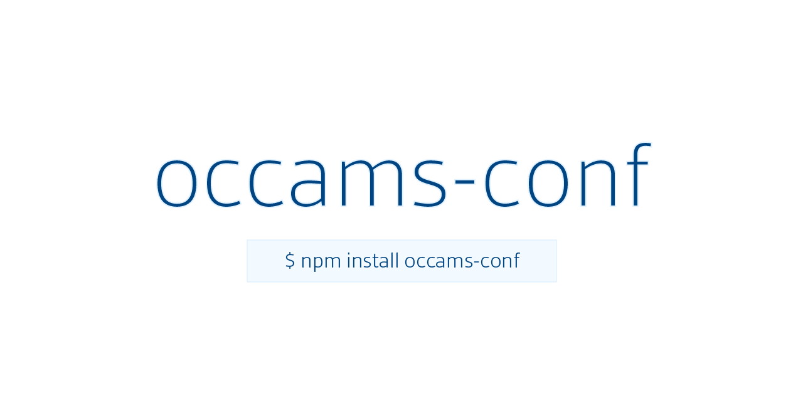

<p align="center">A simple config module</p>

[](https://badge.fury.io/js/occams-conf)  [](https://circleci.com/gh/lxghtless/occams-conf/tree/master)  [](https://codecov.io/gh/lxghtless/occams-conf) [](https://github.com/xojs/xo)

### Why Occam's Config?

- Encourages [Build Once Run Anywhere](https://forums.docker.com/t/build-once-run-anywhere-concept/3522) Node.js Containers via `-e` paramerters in run command
- No opinion of config file name or location
- Load additional config files to merge properties
- Load setting & config paths evaluated as `absolute, cwd path, walk back to root`

> previous versions
- version 1
    + [docs](https://github.com/lxghtless/occams-conf/tree/v1.1.0)

### first things's first...

```sh
$ npm i occams-conf -S
```

### Usage

> load main config via occams settings

```js
const config = require('occams-conf');

console.log(config.yourProp);
```

> load another config merged with main

```js
const config = require('occams-conf').loadConfig({
	configName: 'otherConfig',
	configPath: 'src',
    baseDir: process.cwd()
});

console.log(config.yourProp);
console.log(config.otherProp);
```

### Occam's Settings

- name (config file name) [String]
- path (config path) [String] <b>evaluated as</b> `absolute, cwd path, walk back to root` in order.

### `occams-conf` settings file

Any of these will work. Resolves first one it finds.

> package.json

```json
}
    "occams-conf": {
        "name": "config.js",
        "path": "src"
    }
}
```

> occams.conf.js

```js
const conf = {
	name: 'config.js',
    path: 'src'
};

module.exports = conf;
```

> occams.conf.json

```json
{
    "name": "config.js",
    "path": "src"
}
```

> default

- name: `config.js`
- path: `./`

### Example `config.js`

```js
module.exports = {
    port: process.env.TEST_PORT || 8011,
    name: process.env.TEST_NAME || 'starlord',
    resourceUrl: process.env.TEST_URL || 'https://reqres.in/api/mixtapes'
};
```
